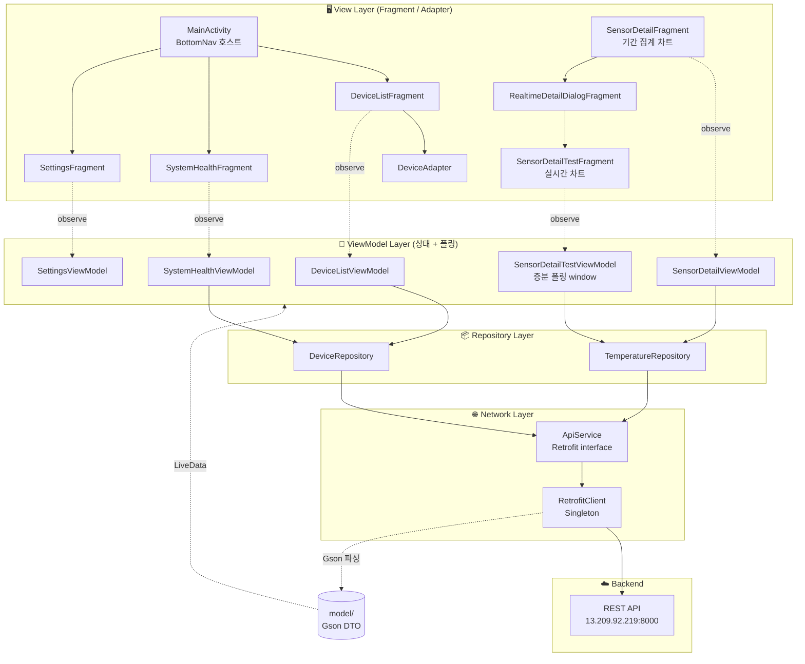
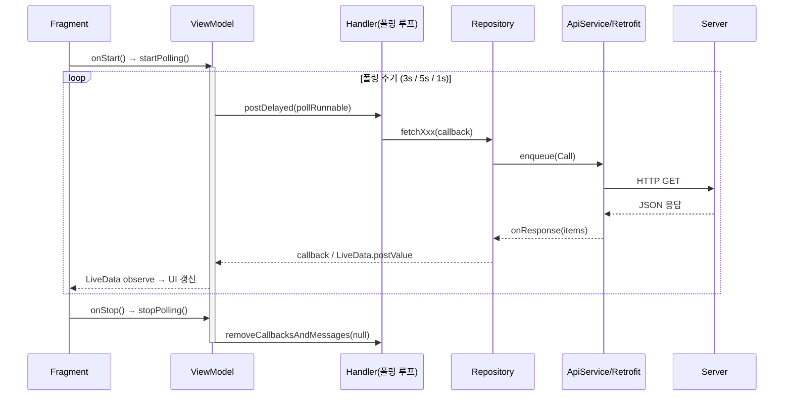

# IN_GPS Mobile (Android)

써미스터(NTC) 온도와 ADXL335 진동(RMS)을 실시간·기간별로 확인하는 Android 모니터링 앱입니다. (Android OS only)

서버가 수집한 디바이스 센서 데이터를 REST API로 폴링(polling)하여, 실시간 상세 차트와 기간별 집계 차트(일/주/월/년, 캘린더 기간)로 시각화합니다.

---

## Tech Stack

| 구분 | 사용 기술 |
|------|-----------|
| Language | Java (Android SDK 24~36) |
| Architecture | **MVVM** + Repository |
| Network | Retrofit2 · OkHttp(logging-interceptor) · Gson |
| Async / State | AndroidX Lifecycle (`ViewModel`, `LiveData`), `Handler` 폴링 |
| UI | Single-Activity + Fragment, Material Components, BottomNavigation |
| Chart | MPAndroidChart v3.1.0 (+ 커스텀 monotone-cubic 보간, Range 오버레이) |
| Local Storage | SharedPreferences (`in_gps_prefs` — 위험 임계온도 등) |

---

## Architecture — MVVM + Repository

UI(Fragment)는 상태를 직접 만들지 않고 `ViewModel`이 노출한 `LiveData`만 관찰(observe)합니다. `ViewModel`은 폴링 타이머를 돌리며 `Repository`에 데이터를 요청하고, `Repository`는 Retrofit(`ApiService`)을 통해 서버와 통신합니다. 각 레이어는 아래 방향으로만 의존합니다.



### 레이어별 책임

| Layer | 패키지 | 책임 |
|-------|--------|------|
| **View** | `fragment/`, `adapter/`, `screen/` | 화면 렌더링, 사용자 입력, `LiveData` 관찰. 생명주기(`onStart`/`onStop`)에 폴링 시작/정지를 위임 |
| **ViewModel** | `viewmodel/` | 화면 상태 보유(`LiveData`), `Handler` 기반 폴링 스케줄링, 데이터 가공. 구성 변경(회전)에도 상태 유지 |
| **Repository** | `repository/` | 데이터 소스 추상화. Retrofit 비동기 콜백을 `LiveData`/콜백 인터페이스로 변환 |
| **Network** | `api/` | Retrofit `ApiService` 계약 + `RetrofitClient` 싱글턴(OkHttp 타임아웃·로깅) |
| **Model** | `model/` | 서버 JSON ↔ 객체 매핑(Gson `@SerializedName`) |

---

## Data Flow — 실시간 폴링

화면이 보이는 동안에만 폴링하고(`onStart`→`startPolling`, `onStop`→`stopPolling`), 백그라운드 네트워크/배터리 낭비를 막습니다. 실시간 상세(`SensorDetailTestViewModel`)는 **증분(since) 폴링**으로 최초 1회만 전체를 받고 이후엔 새 행만 수신합니다.



**증분 폴링 (SensorDetailTestViewModel)**: 최초 `fetchRecent(WINDOW_SIZE)`로 최근 60건을 받아 sliding window를 구성하고, 이후 매초 `fetchSince(lastTs)`로 마지막 수신 시각 이후 새 행만 병합합니다. 새 행이 없으면 `LiveData`를 갱신하지 않아 차트 재렌더도 생략됩니다(페이로드 ~98% 절감).

---

## Design Patterns

| 패턴 | 적용 위치 | 목적 |
|------|-----------|------|
| **MVVM** | `viewmodel/` ↔ `fragment/` | View와 상태/로직 분리, 구성 변경에도 상태 유지 |
| **Repository** | `DeviceRepository`, `TemperatureRepository` | 데이터 소스 추상화, ViewModel을 Retrofit에서 격리 |
| **Singleton** | `RetrofitClient` (double-checked locking) | Retrofit/OkHttp 인스턴스 1개 공유 |
| **Factory Method** | `SensorDetailViewModel.Factory`, `Fragment.newInstance()` | 생성자 인자(deviceId) 주입, 표준 Fragment 인자 전달 |
| **Observer** | `LiveData` ↔ `observe()` | 데이터 변경 → UI 자동 반영 |
| **Adapter** | `DeviceAdapter` (RecyclerView) | 데이터 리스트 ↔ 뷰 바인딩 |
| **Callback / Strategy** | `OnItemsCallback`, `OnDevicesLoadedCallback`, `TempMarkerView.LabelFormatter` | 비동기 결과 전달, 뷰별 라벨 포맷 주입 |
| **Custom View Overlay** | `SensorDetailFragment.RangeOverlay` | 차트 위 min~max 캡슐 바 직접 렌더 |

---

## Project Structure

```
IN_GPS/
├─ app/
│  ├─ build.gradle                # 의존성 (Retrofit, MPAndroidChart, Lifecycle …)
│  └─ src/main/
│     ├─ AndroidManifest.xml      # INTERNET 권한, MainActivity 진입점
│     ├─ java/com/example/in_gps/
│     │  ├─ screen/
│     │  │  └─ MainActivity.java              # Single-Activity + BottomNav Fragment 호스트
│     │  │
│     │  ├─ fragment/                         # ── View Layer ──
│     │  │  ├─ DeviceListFragment.java        # 디바이스 목록(RecyclerView, 3s 폴링)
│     │  │  ├─ SystemHealthFragment.java      # 상태별 집계 BarChart(3s 폴링)
│     │  │  ├─ SettingsFragment.java          # 폴링 주기 · 위험 임계온도 설정
│     │  │  ├─ SensorDetailFragment.java      # 기간 집계 차트(일/주/월/년·캘린더)  ★핵심
│     │  │  ├─ RealtimeDetailDialogFragment.java  # 실시간 차트 호스팅 다이얼로그
│     │  │  └─ SensorDetailTestFragment.java  # 실시간 온도·진동 차트(1s 증분 폴링) ★핵심
│     │  │
│     │  ├─ adapter/
│     │  │  └─ DeviceAdapter.java             # 디바이스 목록 RecyclerView 어댑터
│     │  │
│     │  ├─ viewmodel/                        # ── ViewModel Layer ──
│     │  │  ├─ DeviceListViewModel.java       # 디바이스 목록 폴링
│     │  │  ├─ SystemHealthViewModel.java     # 상태 집계(normal/warning/critical/disconnected)
│     │  │  ├─ SettingsViewModel.java         # 폴링 주기 상태
│     │  │  ├─ SensorDetailViewModel.java     # 최신값 폴링 + 기간/캘린더/보유날짜 조회
│     │  │  └─ SensorDetailTestViewModel.java # 실시간 sliding-window 증분 폴링
│     │  │
│     │  ├─ repository/                       # ── Repository Layer ──
│     │  │  ├─ DeviceRepository.java          # /devices
│     │  │  └─ TemperatureRepository.java     # /temperature, /temperature/chart, /dates
│     │  │
│     │  ├─ api/                              # ── Network Layer ──
│     │  │  ├─ ApiService.java                # Retrofit 엔드포인트 인터페이스
│     │  │  └─ RetrofitClient.java            # Retrofit/OkHttp 싱글턴
│     │  │
│     │  ├─ model/                            # ── Data Model (Gson DTO) ──
│     │  │  ├─ DeviceModel.java  / DeviceModelResponse.java
│     │  │  ├─ TemperatureModel.java / TemperatureResponse.java
│     │  │  ├─ AvailableDatesResponse.java
│     │  │  └─ DeviceLogModel.java / DeviceLogResponse.java
│     │  │
│     │  └─ util/
│     │     ├─ ChartInterpolation.java        # Fritsch–Carlson monotone-cubic 보간
│     │     └─ TempMarkerView.java            # 차트 스크럽 말풍선 마커
│     │
│     └─ res/
│        ├─ layout/     # 화면·다이얼로그·리스트 아이템 XML
│        ├─ drawable/   # 아이콘·shape
│        ├─ menu/       # bottom_nav_menu
│        ├─ values/     # colors, strings, themes
│        └─ xml/        # network_security_config(평문 HTTP 허용), backup_rules
│
├─ build.gradle · settings.gradle · gradle.properties
└─ README.md
```

---

## Screens

| 화면 | Fragment | 데이터 | 폴링 |
|------|----------|--------|------|
| 디바이스 목록 | `DeviceListFragment` | `/devices` | 3s |
| 시스템 상태 | `SystemHealthFragment` | `/devices` 상태 집계 | 3s |
| 센서 상세(기간) | `SensorDetailFragment` | `/temperature`, `/temperature/chart`, `/temperature/dates` | 5s(최신값) |
| 실시간 상세 | `SensorDetailTestFragment` | `/temperature?since=` 증분 | 1s |
| 설정 | `SettingsFragment` | SharedPreferences | — |

---

## API Endpoints (`ApiService`)

| Method | Endpoint | 용도 |
|--------|----------|------|
| `GET` | `/devices` | 디바이스 목록 |
| `GET` | `/temperature?device_id&limit` | 최근 N건 raw |
| `GET` | `/temperature?device_id&since&limit` | 증분(since 이후 새 행, ASC) |
| `GET` | `/temperature/chart?device_id&days&bucket` | 기간 서버 집계(1m/1d) |
| `GET` | `/temperature/chart?device_id&start&end&bucket` | 기간(시작~종료) 집계 |
| `GET` | `/temperature/dates?device_id` | 데이터 보유 날짜(캘린더용) |
| `GET` | `/devices/{device_id}/logs?limit` | 디바이스 로그 |

> **집계 버킷 전략**: 페이로드 최소화를 위해 1일 뷰는 `1m`(분단위), 그 이상은 `1d`(일단위) 버킷을 서버에서 집계해 수신합니다.

---

## Chart Rendering 특징

- **Monotone-cubic 보간**(`ChartInterpolation`): 곡선이 원본 점을 정확히 통과하고 인접 두 점의 범위를 벗어나지 않아, 위험 임계선을 오버슈트로 '거짓 초과'하지 않습니다.
- **집계뷰(주/월/년)**: 버킷별 `min~max`를 `RangeOverlay`(커스텀 View)가 캡슐 바로 그리고, 평균은 점(dot)으로 표시.
- **실시간뷰**: EMA(α=0.45) 평활 + 재연결 공백(5s↑) 지점에서 선을 끊어 오도 연결 방지.
- **터치 스크럽**(`TempMarkerView`): 원본 값에만 스냅되는 투명 데이터셋으로 지점 값 말풍선 표시.
- **위험 임계온도**: `SettingsFragment`에서 설정(`in_gps_prefs`), 기본 40°C. 초과 지점은 빨간 마커/음영으로 강조.

---

## Requirements

- Android Studio, Android SDK 24+ (target 36)
- Java 11

## Build

- Android Studio에서 `app` 모듈 실행, 또는 생성된 `.apk` 설치
- 서버 주소는 `RetrofitClient.BASE_URL`에서 설정 (평문 HTTP 사용 → `res/xml/network_security_config.xml` 참조)
