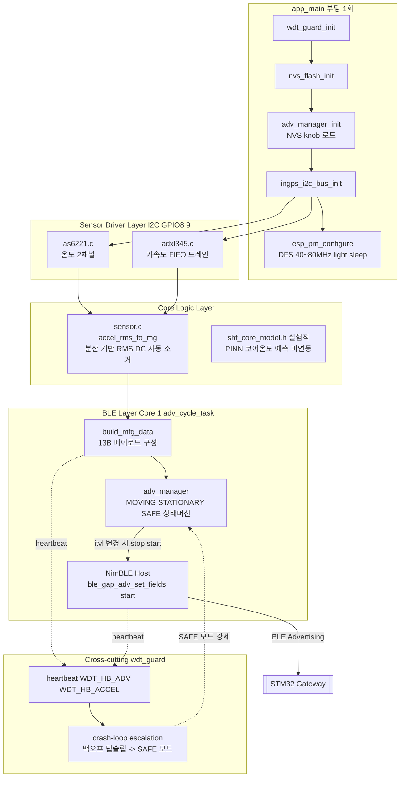

# IN-GPS (Firmware, ESP32-S3) — rev 4.0

산업 설비의 온도·진동을 상시 감시해 화재를 예방하는 IN-GPS 시스템의 센서 노드 펌웨어입니다. AS6221(I2C 디지털 온도) 2채널과 ADXL345(I2C 가속도) 3축을 읽어 BLE Manufacturer Specific Data로 광고하고, STM32 Gateway가 스캔해 MQTT로 서버에 전달합니다.

> **rev 4.0에서 아날로그 경로(ULP + NTC 서미스터 + ADXL335)가 전량 폐기되고 단일 I2C 버스(AS6221 + ADXL345) 로 대체되었습니다.** ULP RISC-V 코어, `ulp/` 디렉터리, ADC 캘리브레이션 기반 온도 변환은 더 이상 사용하지 않습니다(과거 아날로그 버전은 `Analog_1.0.0_ver` 브랜치 참조).

---

## Tech Stack

| 구분 | 내용 |
|------|------|
| SoC | ESP32-S3-WROOM-1-N16R8 |
| Framework | ESP-IDF 5.x |
| BLE | NimBLE (bt component), 비연결 광고(`ADV_NONCONN_IND`) |
| 센서 버스 | 단일 I2C(100kHz), GPIO8(SDA)/GPIO9(SCL) |
| 온도 | AS6221 × 2채널 (I2C 디지털, 오차 없는 정수 변환) |
| 진동 | ADXL345 (I2C, FIFO 드레인 → 분산 기반 RMS) |
| 전력 관리 | esp_pm DFS(40~80MHz) + light sleep, 적응형 BLE 광고 cadence |
| 안정성 | 5계층 워치독(`wdt_guard`), NVS 기반 정책 knob(`nvs_safe`) |
| 저장소 | NVS (`advm` 네임스페이스 — 광고 정책 파라미터) |

---

## Architecture — Layer 구성

부팅 시 I2C 버스를 먼저 세우고 드라이버는 device만 등록합니다(포트당 버스는 1회만 생성 가능). 센서 판독 → RMS/온도 변환 → mfg_data 인코딩 → BLE 광고까지가 `adv_cycle_task`(Core 1) 한 사이클이며, `adv_manager`가 매 사이클 상태 전이를 계산합니다. `wdt_guard`는 전 레이어를 가로질러 heartbeat를 감시합니다.



### 레이어별 책임

| Layer | 파일 | 책임 |
|-------|------|------|
| **Boot** | `app_main.c` | 초기화 순서 고정(워치독→NVS→광고정책→I2C→PM), 실패해도 부팅은 계속(온도 NULL/진동 0으로 광고) |
| **Sensor Driver** | `sensor/i2c_bus.c`, `as6221.c`, `adxl345.c` | I2C 버스 소유, 센서별 device 등록·판독·장애 감지(60s 백오프) |
| **Core Logic** | `sensor/sensor.c` | RMS 변환(분산 공식 — zero 캘리브레이션 불필요) |
| **BLE** | `ble/ble_adv.c`, `ble/adv_manager.c` | mfg_data 인코딩, 적응형 광고 cadence, TX 파워 knob |
| **Watchdog** | `watchdog/wdt_guard.c`, `wdt_test.c` | 5계층 워치독, heartbeat 신선도 감시, crash-loop escalation, 장애 주입 테스트 |
| **Config** | `board_pins.h`, `nvs_safe.c` | 핀맵 단일 출처, NVS 읽기/쓰기 안전 래퍼 |

---

## BLE Advertising Packet (Manufacturer Specific Data, 13B)

게이트웨이·서버(`temperature_log`)와의 경계면 계약입니다. **바이트 배치를 바꾸면 게이트웨이 파서와 서버 스키마가 함께 깨집니다.**

| Offset | 크기 | 내용 |
|--------|------|------|
| 0~1 | 2B | Company ID `0x1234` (LE) |
| 2~3 | 2B | temp1 × 100, int16 LE — AS6221 #1 (TH1) |
| 4~5 | 2B | temp2 × 100, int16 LE — AS6221 #2 (TH2) |
| 6~7 | 2B | rms_x (mg), uint16 LE — ADXL345 |
| 8~9 | 2B | rms_y (mg), uint16 LE |
| 10~11 | 2B | rms_z (mg), uint16 LE |
| 12 | 1B | device ID (`ESP_DEVICE_ID`) |

ex) `temp1 = 2550` → 25.50°C, `rms_x = 20` → 20mg

> I2C 전환(아날로그 → 디지털)에서도 이 13B 레이아웃 자체는 유지됩니다 — 값을 만드는 경로만 바뀌었고 게이트웨이/서버/앱은 손댈 필요가 없습니다.

---

## 적응형 BLE 광고 정책 (`adv_manager`)

배터리(LS14500, 1년 목표) 절감을 위해 광고 인터벌을 상황에 따라 조정합니다. NVS `advm` 네임스페이스로 전 파라미터 조정 가능합니다.

| 상태 | 인터벌 | 전이 조건 |
|------|--------|-----------|
| `MOVING` | 1s | RMS 최대값 > 25mg 또는 \|ΔT\| ≥ 0.5°C 발생 시 즉시 진입 |
| `STATIONARY` | 3s | 5분간(`quiet_ms`) 무모션 + 온도 안정 |
| `SAFE` | 10s | `wdt_guard` crash-loop escalation이 SAFE 모드를 선언 (8회 이상 연속 비정상 리셋) |
| `FIXED` | 1s(knob) | 정책 knob으로 적응형 비활성화(비교실험/보수 운용) |

TX 파워는 기본 +9dBm(컨트롤러 기존 동작값 유지), knob으로 -24~+20dBm 조정 가능.

---

## 워치독 / 자가복구 (`wdt_guard`)

| 계층 | 감시 대상 | 대응 |
|------|-----------|------|
| L1 앱 헬스모니터 | `WDT_HB_ADV`(15s), `WDT_HB_ACCEL`(75s) heartbeat 신선도 | 사유 로그 후 재부팅 |
| L2 Task WDT | 등록 태스크(main/adv_cycle/모니터) + 양쪽 idle | 8s 무응답 시 panic |
| L3 Interrupt WDT | ISR/스케줄러 정지 | 300ms 무응답 시 panic |
| L4 panic handler | 모든 panic | 재부팅으로 수렴 |
| L5 부트로더 RTC WDT | 부팅 중 정지 | 9s 무응답 시 재부팅 |

**crash-loop escalation**: 연속 비정상 리셋 3회부터 지수 백오프 딥슬립(30s×2^k, 상한 600s), 8회부터 SAFE 모드(10s 최소 광고), 무사고 1시간 지속 시 카운터 자동 클리어.

---

## Hardware (rev 4.0 / I2C_final_ver.pdf 기준)

핀맵의 단일 출처는 [`board_pins.h`](main/board_pins.h)입니다 — 다른 곳에 핀 번호를 직접 적지 마세요.

| GPIO | 네트명 | 용도 |
|------|--------|------|
| 8 | SDA_OUT | I2C 단일 버스 SDA (ADXL345, AS6221×2, BQ35100 공유) |
| 9 | SCL_OUT | I2C 단일 버스 SCL |
| 15 / 16 | XTAL_32K_P/N | 32.768kHz 크리스털 전용 — **GPIO로 사용 금지** |
| 13 / 14 | ALERT_TH1/2 | AS6221 ALERT (이 버전 미사용, 향후 EXT1 웨이크 후보) |
| 12 | ALERT_OUT | BQ35100 ALERT (이 버전 미구현) |
| 10 | LBO_OUT | 저전압 표시 (이 버전 미구현) |
| 48 | RGB LED | 데브킷 전용, 실장 보드에는 미실장 |

> I2C 외부 풀업이 10kΩ이라 400kHz 불가 — **100kHz(standard mode) 고정**입니다.

---

## Requirements

- ESP-IDF 5.x
- Target: ESP32-S3 (16MB Flash / 8MB PSRAM)
- NimBLE (bt component)
- I2C 마스터 드라이버 (`i2c_bus.c`가 소유, 드라이버는 device만 등록)

## Build & Flash

```bash
idf.py build
idf.py -p (PORT) flash monitor
```

디버그 로그는 기본 전역 묵음(`ESP_LOG_NONE`)이며, `WDT_GUARD` / `BLE_ADV` / `ADV_MGR` / `AS6221` / `I2C_BUS` / `ADXL345` 태그만 부팅/상태전이 시 출력됩니다 — 매초 도는 데이터 로그(`ESP_LOGD`)는 배터리 마진 때문에 항상 묵음입니다.

## Gateway 연동

- Gateway는 BLE 스캔 시 Device Name `IN_GPS` + Company ID `0x1234` 로 1차 필터링
- 이후 BLE Source MAC을 화이트리스트에 자동 등록하여 기기별 구분

---

## 알려진 미완/실험 항목

- `sensor/shf_core_model.h`: PINN 기반 코어 온도 예측 모델이 삽입되어 있으나 **`app_main.c`에서 아직 호출되지 않습니다**(미연동). 벤치 데이터로만 검증(MAE 0.508°C), 실제 하드웨어/타겟 미검증 표기가 파일 헤더에 있습니다.
- `adv_manager_enter_storage()`: 보관 모드(딥슬립 7µA) API는 구현되어 있으나 호출 경로 없음 — 향후 버튼/설정 채널용.
- ADXL345는 딥슬립 중에도 measure 모드로 전류를 소모합니다(전원 게이팅 회로 없음, INT 미접속이라 소프트웨어로만 절전 가능 — `adxl345_test_force_standby()`).

## Branch 안내

- `main`: 최신 안정 버전
- `digitalVer`: rev 4.0 I2C 전환(AS6221 + ADXL345, ULP 제거) — 이 README가 기술하는 아키텍처
- `Analog_1.0.0_ver`: 구 아날로그 경로(ULP + NTC + ADXL335) 최종본, 참고용 보존
