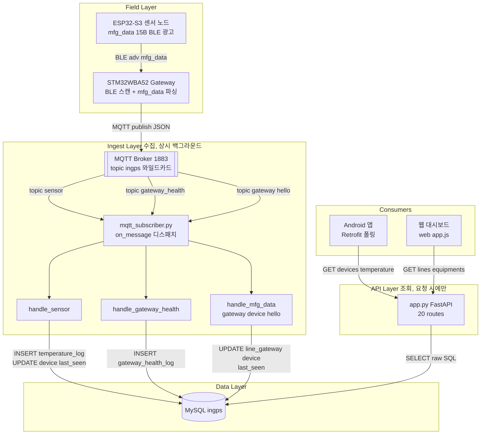
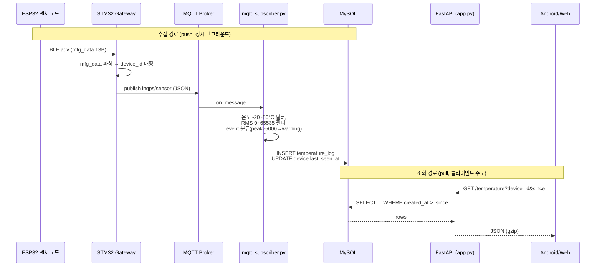

# IN-GPS Server (FastAPI · AWS EC2)

산업 설비의 온도(NTC/AS6221)·진동(RMS) 센서 데이터를 MQTT로 수집해 MySQL에 적재하고, REST API로 Android 앱과 웹 대시보드에 제공하는 백엔드입니다.

수집(MQTT Subscriber)과 조회(FastAPI)는 완전히 분리된 프로세스입니다 — MQTT 수집은 항상 백그라운드로 돌고, 클라이언트는 그 결과를 폴링으로 가져갈 뿐입니다.

---

## Tech Stack

| 구분 | 사용 기술 |
|------|-----------|
| Language | Python 3.x |
| API | FastAPI 0.115 + Uvicorn |
| ORM / DB Access | SQLAlchemy 2.0 (raw SQL, `text()`) + PyMySQL |
| DB | MySQL (`ingps`) |
| MQTT | paho-mqtt 1.6 (`mqtt_subscriber.py`, 별도 프로세스) |
| Auth | 세션 쿠키 (`auth.py`, `web_user` 테이블) |
| Compression | `GZipMiddleware` (minimum_size=1024) |
| Web 대시보드 | 정적 HTML/JS (`web/`), FastAPI `StaticFiles`로 서빙 |
| Infra | AWS EC2, systemd |

---

## Architecture — Layer 구성

MQTT 수집 경로와 REST 조회 경로는 서로를 호출하지 않고, **오직 MySQL을 통해서만** 만납니다. 이 분리 덕분에 수집 쪽 장애가 조회 API를 막지 않고, 반대로 앱이 API를 두들겨도 센서 적재에는 영향이 없습니다.



### 레이어별 책임

| Layer | 파일 | 책임 |
|-------|------|------|
| **Field** | (별도 저장소) | ESP32 mfg_data 생성, Gateway BLE→MQTT 변환 — [`in_gps_project`](../esp/in_gps_project), [`IN_GPS_GATEWAY_PCB_TEST`](../ingps_Gateway/IN_GPS_GATEWAY_PCB_TEST) |
| **Ingest** | `mqtt_subscriber.py` | `ingps/#` 구독, 토픽별 핸들러 디스패치, 유효성 필터링(온도 범위·RMS 범위), DB 적재. **API와 별개 프로세스로 상시 실행** |
| **Data** | `*.sql`, `db.py` | 스키마 정의 + SQLAlchemy 엔진/세션 팩토리 |
| **API** | `app.py` | REST 엔드포인트, 인증(`auth.py`), 서버측 집계(bucket), gzip 압축, 정적 웹 서빙 |
| **Consumers** | (외부 저장소 / `web/`) | Android 앱(폴링), 웹 대시보드(운영자용) |

---

## Data Flow — 센서 값 수집 → 조회

수집은 **push**(MQTT), 조회는 **pull**(폴링)이라 두 흐름의 타이밍이 완전히 분리됩니다. 센서 값이 DB에 들어간 시점과 앱이 그 값을 읽어가는 시점 사이에는 보장된 지연이 없습니다 — 앱의 다음 폴링 주기(1s~5s)까지 기다립니다.



### 조용히 데이터가 사라지는 지점 (알려진 함정)

| 지점 | 조건 | 결과 |
|------|------|------|
| `esp_byte_to_device_id()` | mfg_data 13번째 바이트가 0~9 범위 밖 | `device_id=None` → 로그만 남기고 행 자체가 버려짐 |
| 온도 유효 범위 필터 | `temp < -20°C` 또는 `> 80°C` | 그 필드만 `NULL` 저장 (행은 남음, 집계에서 제외) |
| RMS 필드 제약 | `rms_x/y/z`가 uint16 범위(0~65535) 밖 | FastAPI가 422로 거부 (POST `/sensor` 경로 한정) |
| 이벤트 분류 임계치 | `_classify_event`: RMS 3축 중 최대값 ≥ 5000 | `"warning"`으로 자동 분류 (ML 임계치로 교체 예정) |

---

## Project Structure

```
in_gps_server/
├─ app.py                    # FastAPI 앱 — 20개 라우트 (인증/조회/집계/디버그)
├─ auth.py                   # 세션 쿠키 발급/검증 (web_user 테이블)
├─ db.py                     # SQLAlchemy 엔진 + get_db() 세션 팩토리
├─ mqtt_subscriber.py        # MQTT 구독 프로세스 (별도 실행, app.py와 무관)
├─ cleanup_outliers.py / .sql  # 이상치 정리 스크립트
├─ seed_scenario.py          # 데모/테스트용 시나리오 데이터 시딩
├─ requirements.txt
├─ in_gps_db_init_ver.sql    # line/equipment/device/device_log/line_gateway
├─ in_gps_db_ver_2.sql       # ml_model
├─ in_gps_db_ver_3.sql       # event_log
├─ in_gps_db_ver_4.sql
├─ in_gps_db_ver_5.sql       # gateway_health_log
├─ in_gps_db_ver_6.sql       # temperature_log.core_temp 컬럼 추가 (EC2 반영 미확인)
├─ in_gps_db_user.sql        # web_user
├─ temperature_db_init.sql   # temperature_log
└─ web/                      # 운영자용 웹 대시보드 (정적 HTML/JS)
   ├─ index.html / login.html / signup.html
   ├─ app.js
   └─ style.css / logo.svg
```

> DB 스키마 정의는 버전별 SQL 파일에 흩어져 있습니다. **파일 존재 ≠ EC2 실제 DB 반영** — 신규 테이블/컬럼을 전제로 작업할 때는 근거 파일과 함께 "EC2 반영 여부 미확인"을 반드시 표기하세요.

---

## API Endpoints (`app.py`)

| Method | Endpoint | 용도 | 주 소비처 |
|--------|----------|------|----------|
| `POST` | `/auth/signup`, `/auth/login`, `/auth/logout` | 웹 대시보드 인증 | Web |
| `GET` | `/auth/me` | 로그인 상태 확인 | Web |
| `GET` | `/health` | 헬스체크 | 운영 |
| `GET` | `/lines`, `/equipments` | 설비 계층 조회 | Web |
| `GET` | `/devices` | 디바이스 목록 + 상태 + **최신 온도** | **Android**, Web |
| `GET` | `/devices/{device_id}/logs` | 디바이스 로그 | **Android**, Web |
| `GET` | `/chart/{device_id}` | (레거시) 차트 데이터 | Web |
| `GET`/`POST` | `/sensor` | 센서 로그 조회/수동 삽입(디버그) | 운영/디버그 |
| `GET` | `/gateway_health` | 게이트웨이 헬스 로그 | Web |
| `GET` | `/temperature` | 최근 N건 / 증분(`since`) 조회 | **Android** |
| `GET` | `/temperature/chart` | 기간 서버측 집계(`bucket=1m/1h/1d`) | **Android** |
| `GET` | `/temperature/dates` | 데이터 보유 날짜 목록 | **Android** |
| `POST` | `/debug/bootstrap`, `/debug/log` | 디버그용 데이터 주입 | 개발 |
| `GET` | `/export/sensor.csv` | CSV 내보내기 | 운영 |
| `GET` | `/` | 웹 대시보드 정적 서빙 | Web |

> **Android 앱(`ApiService.java`)이 실제로 소비하는 것은 위 굵게 표시한 6개뿐입니다.** 나머지는 웹 대시보드/운영/디버깅 전용이며, 서버는 필드명을 snake_case 그대로 반환합니다 — Java 모델에서 `@SerializedName` 누락 시 Gson이 조용히 null을 넣습니다(컴파일 통과, 크래시 없음, 차트만 빈 상태).

### `GET /devices` 응답 필드 (`{"items": [ ... ]}`)

쿼리 파라미터: `equipment_id`(선택) — 지정 시 해당 설비의 디바이스만.

| 필드 | 타입 | NULL | 설명 |
|------|------|------|------|
| `device_id` | string | 아니오 | 예: `esp_32_0` |
| `equipment_id` | string | 예 | 소속 설비 |
| `status` | string | 아니오 | `last_seen_at`이 15초 이내면 `device.status`, 아니면 `Disconnected`로 **계산**된 값 |
| `installed_on` | string(date) | 예 | |
| `last_seen_at` | string(datetime) | 예 | |
| `created_at` | string(datetime) | 아니오 | **디바이스 등록 시각** (온도 시각 아님) |
| `updated_at` | string(datetime) | 아니오 | |
| `latest_temp1` | float | 예 | 최신 표면온도. 2026-09-01 추가 |
| `latest_core_temp` | float | 예 | 최신 AI 추정 코어온도. 2026-09-01 추가 |
| `latest_temp_at` | string(datetime) | 예 | 위 두 값이 나온 `temperature_log.created_at`. 2026-09-01 추가 |

`latest_*` 3개는 **최근 `LATEST_TEMP_MAX_AGE_MINUTES`(=10)분 이내** `temperature_log` 행이 있을 때만 값이 들어오고, 없으면 셋 다 `null`입니다(신선도 상한 — 오래된 값으로 앱이 알림을 띄우면 오경보이기 때문. `status`가 이미 15초 룰로 신선도를 판정하는 것과 같은 사상이며, 알림용으로 15초는 너무 빡빡해 별도 값을 씁니다). `latest_temp1`만 별도로 `null`인 경우도 있습니다(`_valid_temp` -20~80°C 필터가 걸러낸 행). 디바이스별 최신 1행은 상관 서브쿼리 + `LIMIT 1`로 `idx_device_created`를 타게 되어 있습니다 — 파이썬 루프(N+1)나 `GROUP BY`+`MAX(id)`로 바꾸지 마세요. JOIN 조건이 `lt.id = <서브쿼리 스칼라>` PK 등치라 같은 초에 여러 행이 들어와도 **디바이스당 응답 item은 구조적으로 최대 1개**입니다.

> `temp2`는 **의도적으로 넣지 않았습니다.** 앱의 온도 알림 대상이 아니고 목록 화면도 쓰지 않으므로, 초 단위로 폴링되는 응답에 싣지 않습니다.

**이 엔드포인트를 폴링하는 앱 측 주체는 3개입니다** (2026-09-01 기준, `C:\AndroidProject\IN_GPS`):

| 폴러 | 주기 | 스코프 | 소비 필드 |
|------|------|--------|-----------|
| `DeviceListViewModel` | 3초 | `DeviceListFragment` 생명주기 | `device_id`, `status` |
| `SystemHealthViewModel` | 3초 | `SystemHealthFragment` 생명주기 | `status` (집계) |
| `TempWatchViewModel` | 5초 | `MainActivity` 생명주기 (**화면 무관, 앱 포그라운드 내내**) | `latest_temp1`, `latest_core_temp` (임계 초과 로컬 알림 판정) |

즉 목록 화면이 떠 있으면 같은 응답을 두 폴러가 각각 가져갑니다. 중복은 응답이 ≤10행이라 허용된 것이며, 통합하려면 앱 쪽 리팩터링이 필요합니다. **응답 크기를 늘리는 변경은 이 3중 폴링 위에 얹힌다는 점을 감안하세요.**

> ⚠ **이 엔드포인트가 5xx를 반환해도 앱은 아무 신호를 내지 않습니다.** `DeviceRepository.fetchDevices()`의 `onResponse`에 비2xx `else` 분기가 없고 `onFailure`도 본문이 비어 있어, 실패가 **Logcat에도 남지 않은 채** 3초/5초 폴링만 조용히 반복됩니다. 증상은 "목록 빈 화면 + 알림 미발생 + 로그 없음"입니다 — 이 조합이 보이면 서버 응답을 `curl`로 직접 확인하는 것이 가장 빠릅니다.

---

## MQTT Topics

| 토픽 | 발행 주체 | 핸들러 | 내용 |
|------|-----------|--------|------|
| `ingps/sensor` | Gateway | `handle_sensor` | ESP 온도 + RMS 진동 (mfg_data 파싱 결과) |
| `ingps/gateway_health` | Gateway | `handle_gateway_health` | 재시작 직후 crash_report 요약 |
| `ingps/<gateway_id>/<device_id>` | Gateway | `handle_mfg_data` | gateway/device hello — `last_seen_at` 갱신 |
| `ingps/mvpmodel` | (레거시) | `handle_temperature_legacy` | 구버전 호환용 |

구독은 `ingps/#` 와일드카드 하나로 통합되어 있고, `on_message`가 토픽 문자열로 분기합니다.

---

## DB Tables

| 테이블 | 정의 파일 | 용도 |
|--------|----------|------|
| `line`, `equipment`, `device`, `device_log`, `line_gateway` | `in_gps_db_init_ver.sql`, `_ver_2.sql` | 설비 계층 + 게이트웨이 등록 |
| `ml_model` | `in_gps_db_ver_2.sql` | (예정) ML 임계치 교체용 |
| `web_user` | `in_gps_db_user.sql` | 웹 대시보드 계정 |
| `event_log` | `in_gps_db_ver_3.sql` | 이벤트(경보) 이력 |
| `gateway_health_log` | `in_gps_db_ver_5.sql` | 게이트웨이 재시작/crash 이력 |
| `temperature_log` | `temperature_db_init.sql` + `in_gps_db_ver_6.sql` | 센서 원시 로그 (온도·RMS·event) — 조회 API의 주 소스 |

### `temperature_log.core_temp` (2026-08-31 추가) — **EC2 반영 미확인**

ESP32가 SHF 모델로 추정한 설비 **내부** 온도(`FLOAT NULL`). `GET /temperature`,
`GET /sensor`, `GET /temperature/chart`(AVG), `GET /chart/{device_id}`(series),
**`GET /devices`(`latest_core_temp`, 2026-09-01 추가)** 응답에 포함되며 Android 앱의
"AI 예측 온도" 카드와 온도 알림 감시가 소비한다.

- 적용: `sudo mysql ingps < in_gps_db_ver_6.sql` → `SHOW COLUMNS FROM temperature_log LIKE 'core_temp';`
- ⚠ **DDL을 먼저 적용하고 서버/subscriber를 재시작할 것.** 순서가 뒤집히면 `core_temp`를
  참조하는 SELECT가 HTTP 500을 반환해 조회 API 전체가 멈추고, subscriber의 단일 INSERT도
  실패해 그 행의 temp1/temp2/rms까지 함께 유실된다.
- ⚠ **2026-09-01부터 `GET /devices`도 이 컬럼에 의존한다.** 이전에는 `/devices`가 `device`
  테이블만 단독 조회해서 `core_temp` 미적용 상태에서도 살아남았지만, 이제는 컬럼이 없으면
  **디바이스 목록·시스템 상태 화면이 통째로 500**이 된다. 배포 전 위 `SHOW COLUMNS`로 반드시 확인할 것.
- `temp1`/`temp2`와 달리 유효범위 필터(`_valid_temp`, -20~80°C)를 **적용하지 않는다** —
  과열 설비 내부 추정치라 80°C 초과가 정상이다. 대신 `_cast_float()`가 ESP 무효 센티넬
  배제를 위해 **하한 -200°C만** 검사한다(상한 없음).
- ⚠ **현재 게이트웨이가 mfg_data의 `core_temp` 바이트를 아직 파싱하지 않아 이 값은 실제로
  들어오지 않는다.** 앱은 항상 "측정 불가"를 표시하며 이는 정상 동작이다.

---

## Requirements

- Python 3.x
- MySQL (`ingps` DB, 접속 정보는 `DB_USER`/`DB_PASS`/`DB_HOST`/`DB_PORT`/`DB_NAME` 환경변수)
- MQTT Broker (기본 `localhost:1883`)
- `ingps-key.pem` (EC2 SSH 접속키)

## Run

로컬 개발:
```bash
pip install -r requirements.txt
uvicorn app:app --reload --host 0.0.0.0 --port 8000
python mqtt_subscriber.py   # 별도 프로세스/터미널
```

EC2 배포 (운영 중, systemd로 상시 기동):
```bash
ssh -i ingps-key.pem <ec2-user>@<ipv4>
cd <project-directory>
source .venv/bin/activate
# app.py / mqtt_subscriber.py 모두 systemd 서비스로 등록되어 있음 — 수동 재기동 시:
uvicorn app:app --host 0.0.0.0 --port 8000
```

> EC2 DB DDL 적용, 서버 배포/재시작은 항상 사용자가 직접 실행합니다.
