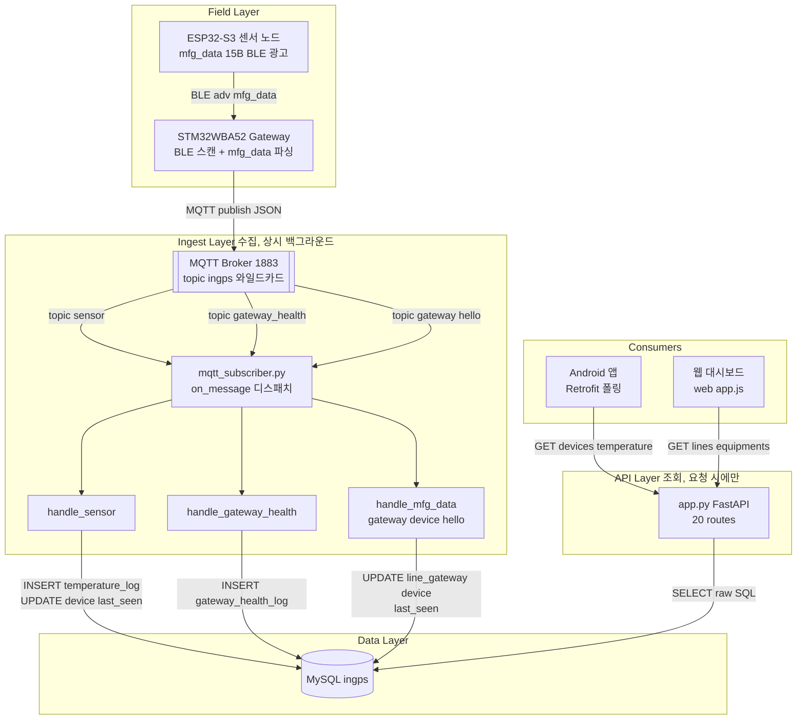
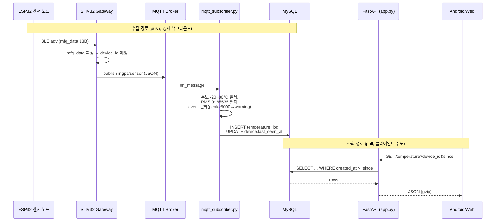

# Server (FastAPI · AWS EC2)

산업 설비의 온도(NTC/AS6221)·진동(RMS) 센서 데이터를 MQTT로 수집해 MySQL에 적재하고, REST API로 Android 앱과 웹 대시보드에 제공하는 백엔드입니다.

수집(MQTT Subscriber)과 조회(FastAPI)는 완전히 분리된 프로세스입니다 — MQTT 수집은 항상 백그라운드로 돌고, 클라이언트는 그 결과를 폴링으로 가져갈 뿐입니다.

---

## Tech Stack

| 구분 | 사용 기술 |
|------|-----------|
| Language | Python 3.x |
| API | FastAPI 0.115 + Uvicorn |
| ORM / DB Access | SQLAlchemy 2.0 (raw SQL, `text()`) + PyMySQL |
| DB | MySQL (`ingps`) |
| MQTT | paho-mqtt 1.6 (`mqtt_subscriber.py`, 별도 프로세스) |
| Auth | 세션 쿠키 (`auth.py`, `web_user` 테이블) |
| Compression | `GZipMiddleware` (minimum_size=1024) |
| Web 대시보드 | 정적 HTML/JS (`web/`), FastAPI `StaticFiles`로 서빙 |
| Infra | AWS EC2, systemd |

---

## Architecture — Layer 구성

MQTT 수집 경로와 REST 조회 경로는 서로를 호출하지 않고, **오직 MySQL을 통해서만** 만납니다. 이 분리 덕분에 수집 쪽 장애가 조회 API를 막지 않고, 반대로 앱이 API를 두들겨도 센서 적재에는 영향이 없습니다.



### 레이어별 책임

| Layer | 파일 | 책임 |
|-------|------|------|
| **Field** | (별도 저장소) | ESP32 mfg_data 생성, Gateway BLE→MQTT 변환 — [`in_gps_project`](../esp/in_gps_project), [`IN_GPS_GATEWAY_PCB_TEST`](../ingps_Gateway/IN_GPS_GATEWAY_PCB_TEST) |
| **Ingest** | `mqtt_subscriber.py` | `ingps/#` 구독, 토픽별 핸들러 디스패치, 유효성 필터링(온도 범위·RMS 범위), DB 적재. **API와 별개 프로세스로 상시 실행** |
| **Data** | `*.sql`, `db.py` | 스키마 정의 + SQLAlchemy 엔진/세션 팩토리 |
| **API** | `app.py` | REST 엔드포인트, 인증(`auth.py`), 서버측 집계(bucket), gzip 압축, 정적 웹 서빙 |
| **Consumers** | (외부 저장소 / `web/`) | Android 앱(폴링), 웹 대시보드(운영자용) |

---

## Data Flow — 센서 값 수집 → 조회

수집은 **push**(MQTT), 조회는 **pull**(폴링)이라 두 흐름의 타이밍이 완전히 분리됩니다. 센서 값이 DB에 들어간 시점과 앱이 그 값을 읽어가는 시점 사이에는 보장된 지연이 없습니다 — 앱의 다음 폴링 주기(1s~5s)까지 기다립니다.



## Project Structure

```
in_gps_server/
├─ app.py                    # FastAPI 앱 — 20개 라우트 (인증/조회/집계/디버그)
├─ auth.py                   # 세션 쿠키 발급/검증 (web_user 테이블)
├─ db.py                     # SQLAlchemy 엔진 + get_db() 세션 팩토리
├─ mqtt_subscriber.py        # MQTT 구독 프로세스 (별도 실행, app.py와 무관)
├─ cleanup_outliers.py / .sql  # 이상치 정리 스크립트
├─ seed_scenario.py          # 데모/테스트용 시나리오 데이터 시딩
├─ requirements.txt
├─ in_gps_db_init_ver.sql    # line/equipment/device/device_log/line_gateway
├─ in_gps_db_ver_2.sql       # ml_model
├─ in_gps_db_ver_3.sql       # event_log
├─ in_gps_db_ver_4.sql
├─ in_gps_db_ver_5.sql       # gateway_health_log
├─ in_gps_db_ver_6.sql       # temperature_log.core_temp 컬럼 추가 (EC2 반영 미확인)
├─ in_gps_db_user.sql        # web_user
├─ temperature_db_init.sql   # temperature_log
└─ web/                      # 운영자용 웹 대시보드 (정적 HTML/JS)
   ├─ index.html / login.html / signup.html
   ├─ app.js
   └─ style.css / logo.svg
```

---

## API Endpoints (`app.py`)

| Method | Endpoint | 용도 | 주 소비처 |
|--------|----------|------|----------|
| `POST` | `/auth/signup`, `/auth/login`, `/auth/logout` | 웹 대시보드 인증 | Web |
| `GET` | `/auth/me` | 로그인 상태 확인 | Web |
| `GET` | `/health` | 헬스체크 | 운영 |
| `GET` | `/lines`, `/equipments` | 설비 계층 조회 | Web |
| `GET` | `/devices` | 디바이스 목록 + 상태 + **최신 온도** | **Android**, Web |
| `GET` | `/devices/{device_id}/logs` | 디바이스 로그 | **Android**, Web |
| `GET` | `/chart/{device_id}` | (레거시) 차트 데이터 | Web |
| `GET`/`POST` | `/sensor` | 센서 로그 조회/수동 삽입(디버그) | 운영/디버그 |
| `GET` | `/gateway_health` | 게이트웨이 헬스 로그 | Web |
| `GET` | `/temperature` | 최근 N건 / 증분(`since`) 조회 | **Android** |
| `GET` | `/temperature/chart` | 기간 서버측 집계(`bucket=1m/1h/1d`) | **Android** |
| `GET` | `/temperature/dates` | 데이터 보유 날짜 목록 | **Android** |
| `POST` | `/debug/bootstrap`, `/debug/log` | 디버그용 데이터 주입 | 개발 |
| `GET` | `/export/sensor.csv` | CSV 내보내기 | 운영 |
| `GET` | `/` | 웹 대시보드 정적 서빙 | Web |


### `GET /devices` 응답 필드 (`{"items": [ ... ]}`)

쿼리 파라미터: `equipment_id`(선택) — 지정 시 해당 설비의 디바이스만.

| 필드 | 타입 | NULL | 설명 |
|------|------|------|------|
| `device_id` | string | 아니오 | 예: `esp_32_0` |
| `equipment_id` | string | 예 | 소속 설비 |
| `status` | string | 아니오 | `last_seen_at`이 15초 이내면 `device.status`, 아니면 `Disconnected`로 **계산**된 값 |
| `installed_on` | string(date) | 예 | |
| `last_seen_at` | string(datetime) | 예 | |
| `created_at` | string(datetime) | 아니오 | **디바이스 등록 시각** (온도 시각 아님) |
| `updated_at` | string(datetime) | 아니오 | |
| `latest_temp1` | float | 예 | 최신 표면온도. 2026-09-01 추가 |
| `latest_core_temp` | float | 예 | 최신 AI 추정 코어온도. 2026-09-01 추가 |
| `latest_temp_at` | string(datetime) | 예 | 위 두 값이 나온 `temperature_log.created_at`. 2026-09-01 추가 |


## Requirements

- Python 3.x
- MySQL (`ingps` DB, 접속 정보는 `DB_USER`/`DB_PASS`/`DB_HOST`/`DB_PORT`/`DB_NAME` 환경변수)
- MQTT Broker (기본 `localhost:1883`)
- `ingps-key.pem` (EC2 SSH 접속키)

## Run

로컬 개발:
```bash
pip install -r requirements.txt
uvicorn app:app --reload --host 0.0.0.0 --port 8000
python mqtt_subscriber.py   # 별도 프로세스/터미널
```

EC2 배포 (운영 중, systemd로 상시 기동):
```bash
ssh -i ingps-key.pem <ec2-user>@<ipv4>
cd <project-directory>
source .venv/bin/activate
# app.py / mqtt_subscriber.py 모두 systemd 서비스로 등록되어 있음 — 수동 재기동 시:
uvicorn app:app --host 0.0.0.0 --port 8000
```

