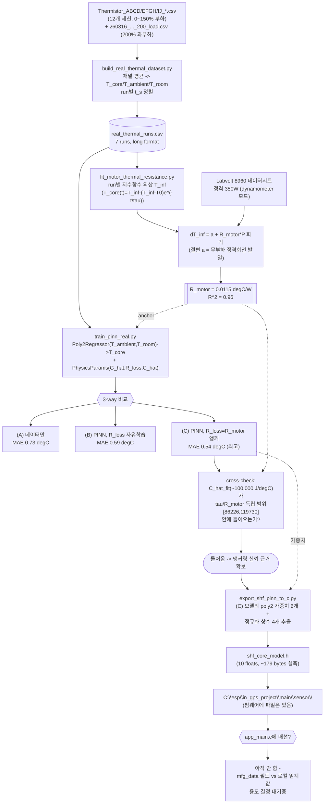
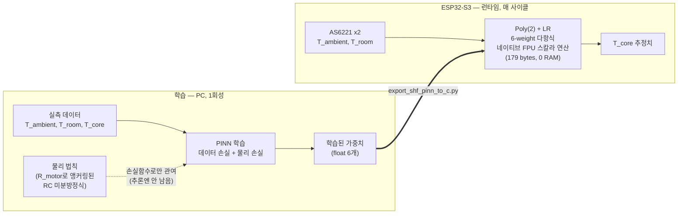

# PINN 파이프라인 Flow

지금까지 만든 PINN 관련 코드는 **서로 다른 데이터를 쓰는 두 갈래**다. 섞어서 보면 헷갈리니 먼저
구분한다.

| | Track A — 실제 벤치 데이터 (완료, 배포 후보) | Track B — 합성 FEM (검토용, 대기중) |
|---|---|---|
| 데이터 출처 | Labvolt 8960 모터 실측(Thermistor_*.csv) | `shf_fem_simulate.py`가 만든 가상 데이터 |
| 입력 신호 | T_ambient(표면), T_room(실내) | T_bottom, T_top (SHF 프로브 양단) |
| 전제 하드웨어 | 지금 있는 AS6221 2채널 그대로 | BESIL-8230/PE폼 2-센서 퍽 — **아직 실물 없음** |
| 상태 | R_motor 앵커링까지 끝, `shf_core_model.h`로 export 완료 | 재질(PDMS vs BESIL)에 따라 성능 갈림, 실물 대기 |

이 문서는 실제로 끝까지 완주한 **Track A**를 중심으로 흐름을 정리하고, Track B는 마지막에 짧게
붙인다.

---

## Track A 전체 흐름도



---

## 단계별 설명

### 1. 원본 데이터 → long format

`build_real_thermal_dataset.py`가 `Thermistor_ABCD/EFGH/IJ_<날짜>.csv` 12개 세션과
`260316_..._200_load.csv`(200% 과부하, 단일 파일 포맷)를 읽어 **채널을 역할별로 평균**한다.

- `T_core` = 모터에 박아둔 코어 서미스터 5개 평균 (실배포엔 없음, 라벨 전용)
- `T_ambient` = 모터 외부 표면 서미스터 5개 평균 (AS6221이 실제로 재는 것과 같은 역할)
- `T_room` = 실내 레퍼런스 1채널

결과를 `run_id, t_s, T_core, T_ambient, T_room, load_pct` 컬럼의 **long format**
(`real_thermal_runs.csv`, 7 runs: 0/25/50/75/100/150/200%)으로 저장한다.

### 2. R_motor — 정상상태 물리 계산 (ML 아님)

`fit_motor_thermal_resistance.py`가 run마다 `T_core(t)`를 단일 지수함수로 피팅해 **진짜
정상상태(T_inf)**를 외삽한다. 여기에 **Labvolt 8960의 데이터시트 정격 350W**를 곱해 부하%를
전력(W)으로 바꾸고, `dT_inf = a + R_motor·P` (절편 있는 선형회귀)를 적용한다.

- 절편 `a≈14.8°C`: 다이나모미터가 0% 부하에서도 정격속도로 계속 회전 중이라 windage/베어링
  마찰/철손이 항상 있다는 게 확인되어 물리적으로 설명됨.
- 기울기 `R_motor=0.0115 °C/W`: 부하 1W당 추가로 오르는 온도. R²=0.96.

이 단계는 ML이 아니라 **정상상태 열역학(Q=CΔV 아님, 여기선 dT=R·P)** 계산이다 — 근거는
`docs/motor_thermal_resistance_estimation.md`.

### 3. PINN 본체 — 3-way 비교

`train_pinn_real.py`의 모델은 아주 작다: `(T_ambient, T_room)` 2개 입력을 degree-2
다항식(5 feature + bias = 6 weight)으로 `T_core`에 매핑하는 `Poly2Regressor` 하나뿐이다.
여기에 물리 손실항을 얹는다.

```
q(t)       = G_hat * (T_ambient(t) - T_core(t))
dT_core/dt = (q(t) - (T_core(t) - T_room(t)) / R_loss) / C_hat
```

`labeled_runs`(라벨 있는 소수 run)에 대해서는 **데이터 손실**(예측 vs 실측 T_core)을,
`labeled+unlabeled` 전체 run에 대해서는 **물리 손실**(위 미분방정식을 만족하는가, T_core
라벨 불필요)을 같이 최소화한다. 세 변형을 비교한다.

| 변형 | R_loss | 결과 (unseen 75%/150% MAE) |
|---|---|---|
| (A) 데이터만 | 물리항 없음 | 0.73°C |
| (B) PINN, 자유학습 | 자기보정(스케일 비식별) | 0.59°C |
| **(C) PINN, 앵커링** | **R_motor=0.0115 (2단계 결과, 고정)** | **0.54°C — 최고** |

### 4. 교차검증 — 우연이 아니라는 근거

(C)를 학습하면 `C_hat`도 같이 나온다(≈100,000 J/°C). 이 값을 **2단계와 완전히 무관한 다른
계산**(run별 지수피팅에서 나온 τ=991~1377s를 R_motor로 나눈 범위, [86226, 119730])과
비교했더니 **그 범위 안에 들어왔다.** 정상상태 회귀(2단계)와 과도응답 곡선피팅(3단계 내부)이라는
서로 다른 방법이 같은 답에 수렴한 것 — 이게 R_loss 앵커링을 신뢰하는 근거다.

### 5. 펌웨어 export

`export_shf_pinn_to_c.py`가 (C) 모델을 다시 학습해 poly2 가중치 6개 + 정규화 상수 4개를
`#define` float로 뽑고, `shf_predict_core_temp(t_ambient_c, t_room_c)` 인라인 함수로
감싼 헤더(`shf_core_model.h`)를 만든다. 실측 컴파일 확인 결과 **플래시 179 bytes, RAM 0
bytes** — 사실상 공짜.

파일은 `C:\esp\in_gps_project\main\sensor\shf_core_model.h`에 이미 있지만,
**`app_main.c`에서 아직 호출하지 않는다** — 추정값을 mfg_data에 실어 서버까지 보낼지,
로컬 임계값 판단에만 쓸지가 남은 결정이다.

---

## Track B — 합성 FEM (참고, 별도 트랙)

Track A와 완전히 다른 질문("BESIL-8230/PE폼 2-센서 퍽이 물리적으로 가능한 설계인가")을 검증하기
위한 트랙이다.

```
shf_fem_simulate.py (2D 축대칭 FEM, kg 0.1~100 W/m·K 스윕)
        │
        ▼
shf_fem_synthetic.csv (T_bottom, T_top, T_core, T_air, kg, h)
        │
        ▼
train_pinn_shf.py — (T_bottom,T_top)->T_core, PINN vs baseline
```

- 코어 재질을 BESIL-8230(k=0.8)으로 넣었더니 넓은 kg 스윕 전체에서 신호가 죽어(MAE 6.1°C,
  물리항 효과 0%) PDMS(k=0.18)로 되돌림 — 그래도 MAE 5.4°C, 물리항 효과는 여전히 미미.
- **실물 프로브가 아직 없어서 이 트랙은 검증만 하고 대기 중**이다. Track A의 export 결과와는
  무관하다.

---

## 재현 명령 (Track A)

```bash
cd C:\jupyter\notebook\ml_validation\scripts
python build_real_thermal_dataset.py       # -> ../data/real_thermal_runs.csv
python fit_motor_thermal_resistance.py     # -> R_motor, ../output/figures/16_r_motor_fit.png
python train_pinn_real.py                  # -> 3-way 비교, ../output/figures/15_pinn_vs_baseline_real.png
python export_shf_pinn_to_c.py             # -> ../output/shf_core_model.h
```

노트북으로 보려면 `notebooks/02_pinn_shf_real_data.ipynb` — 위 4단계가 전부 실행된 상태로
저장되어 있다.


